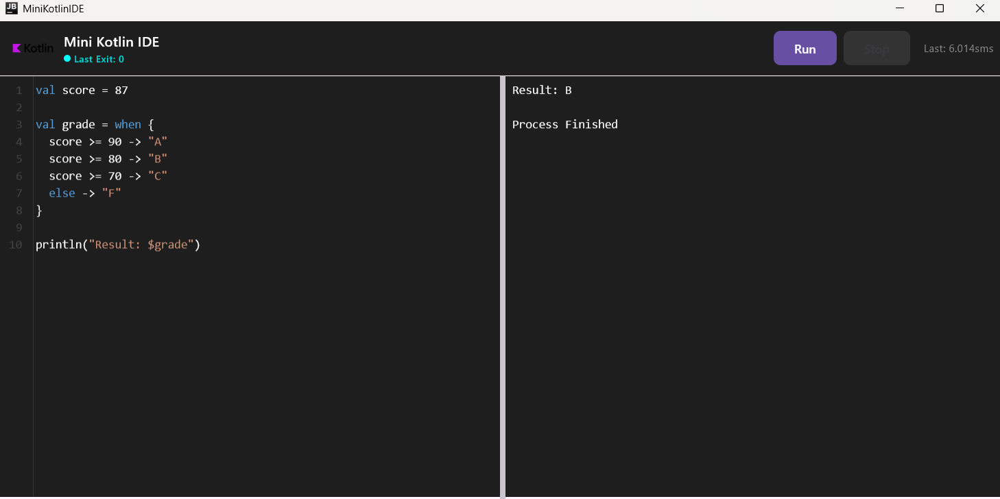
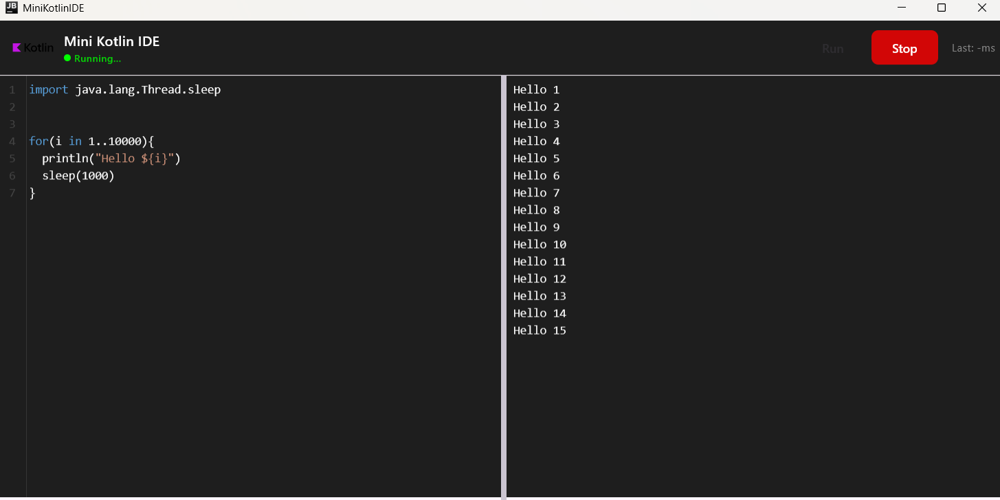

# MiniKotlinIDE

A lightweight Kotlin script editor and runner with syntax highlighting and clickable error output, built with Kotlin Multiplatform and Compose Multiplatform for Desktop.

[](screenshots/video.mp4)
---

## Features

- Kotlin syntax highlighting in the editor
- Clickable error messages with cursor navigation
- Script execution and output pane
- Resizable editor and output panes
- Desktop-first UI built with Compose Multiplatform
- Minimal and fast, optimized for scripts

---

##  Architecture

- **Kotlin Multiplatform**: shared logic between desktop modules
- **Compose Multiplatform**: UI framework for desktop
- **ViewModel + StateFlow**: reactive state management
- **Syntax highlighting**: token-based lexer for Kotlin scripts
- **Error handling**: parses compiler output and links to editor cursor


## Screenshots

<p float="left">
  
  
</p>


---

## Getting Started

### Requirements

- JDK 17+
- Kotlin 2.3+
- Gradle 8+ (or included wrapper)

### Run locally

Clone the repository:

```bash
git clone https://github.com/nikmasi/MiniKotlinIDE.git
cd MiniKotlinIDE
